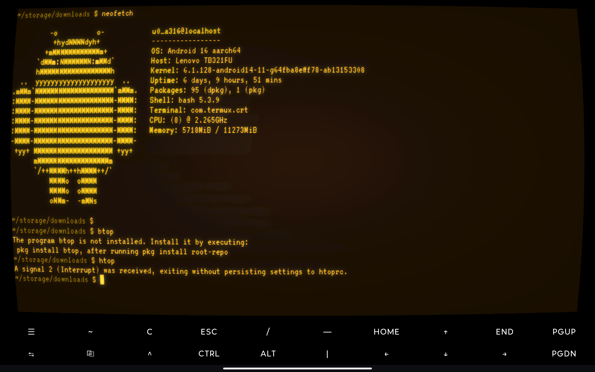
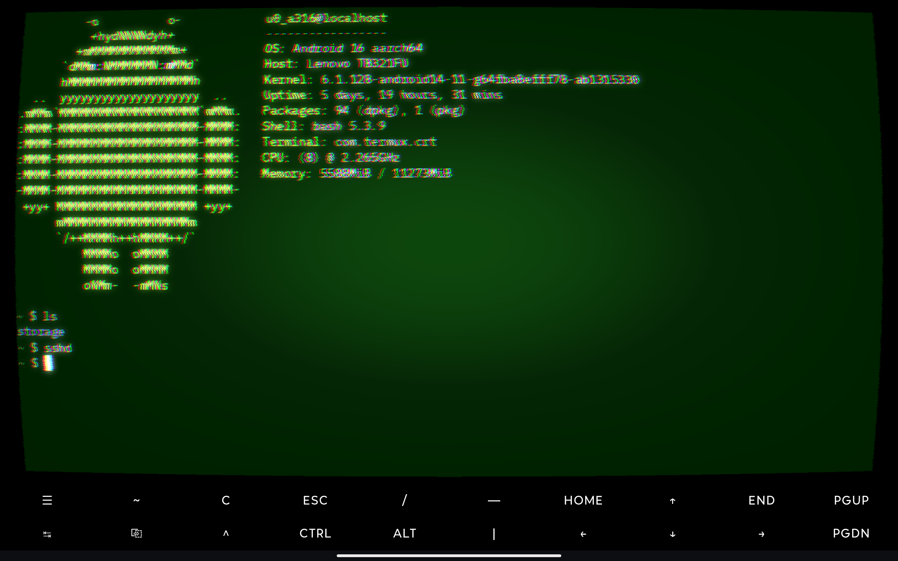
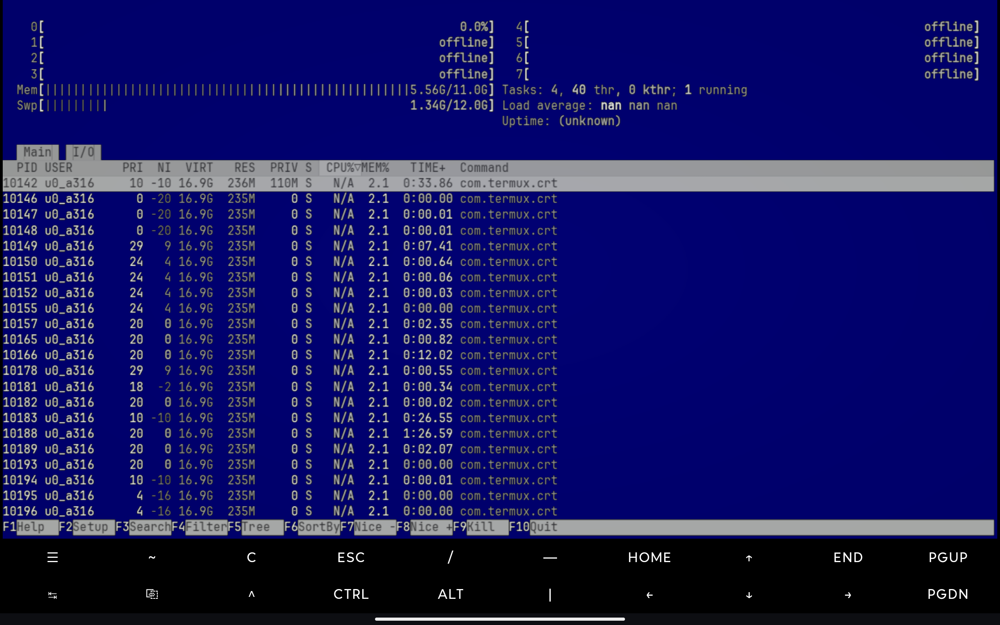
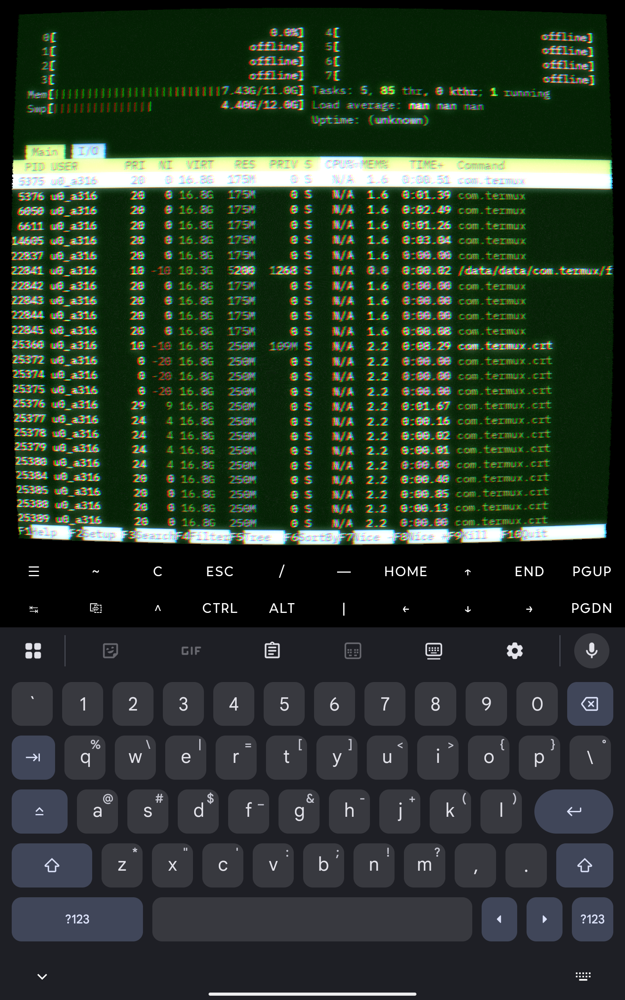
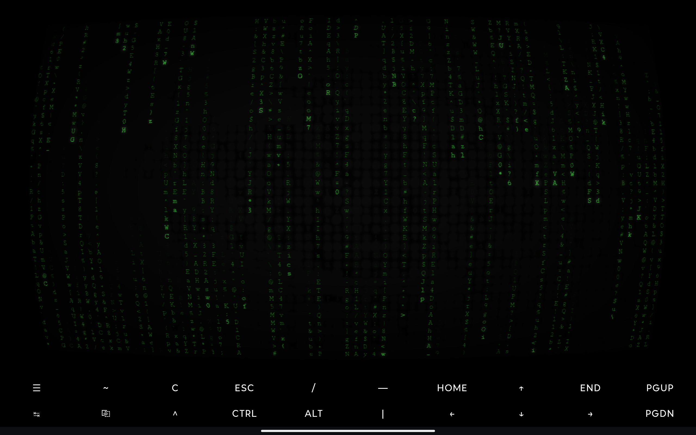

# Termux CRT

> **⚠️ Experimental — not for general use.**
>
> This is a proof-of-concept *extension* of [Termux](https://github.com/termux/termux-app)
> that renders the terminal through a CRT-style fragment shader. It is **not** an
> official Termux project, is not affiliated with the Termux maintainers, and
> has had no security or compatibility review.
>
> Expect rough edges.
>
> **No support, no roadmap, unlikely to receive updates** unless there's
> sustained outside interest. Issues and PRs may sit indefinitely.

An Android terminal that drives Termux's real `TerminalView` and renders it
through a GLES 3 CRT shader: bloom, burn-in, barrel curvature, scanline-style
RGB shift, ambient phosphor, flicker, horizontal sync wobble, static, and
optional single-phosphor color overrides.

It is an extension, not a fork — every shell, package, and `$HOME` file you
already have in Termux is what shows up under the shader.

<p align="center">
  
</p>

<p align="center">
  
  
</p>

<p align="center">
  
  
</p>

## How it installs alongside Termux

Termux CRT is a **separate APK** (`applicationId = com.termux.crt`) that runs
on top of an already-installed Termux. It does **not** ship its own bootstrap.
At runtime it reads `/data/data/com.termux/files/usr` directly to find the
shell, libraries, and your `$HOME`.

This works because:

1. The Manifest declares `android:sharedUserId="com.termux"`, so Android
   assigns this app the same Linux UID as Termux and grants it access to
   Termux's private data directory.
2. The APK is signed with `app/testkey_untrusted.jks`, which is the same
   public dev keystore Termux uses to sign its GitHub-release APKs. Android
   requires both apps share a signing key before honoring `sharedUserId`.

You must have **Termux installed from the [official GitHub releases](https://github.com/termux/termux-app/releases)**.
The F-Droid build of Termux will **not** work — F-Droid re-signs APKs with a
different key, so the shared-UID handshake fails.

## Architecture

```
TermuxActivity (vendored from termux-app)
   │
   ├── TerminalView                ← real TerminalView, alpha=0, in the view tree
   │      └── TerminalSession      ← shell PTY via libtermux.so
   │            (execs Termux's installed shell from /data/data/com.termux/files/usr/bin)
   │
   ├── TerminalViewMirror          ← OnPreDrawListener that captures every draw
   │                                  of the TerminalView into an offscreen Bitmap
   │
   └── CrtSurfaceView              ← GLSurfaceView drawn behind the window
          └── CrtRenderer          ← uploads the capture bitmap, draws fullscreen
                                     quad sampling it through crt.frag
```

`termux-app` is pulled in as a git submodule for reference. The parts we
actually build against (`terminal-emulator`, `terminal-view`, `termux-shared`,
plus a modified copy of the `app/` module) live as sibling Gradle modules.
The native PTY helper (`libtermux.so`) is built by `terminal-emulator/src/main/jni/`.

Each frame:

1. The pre-draw hook on `TerminalView` fires on the UI thread.
   `TerminalViewMirror` draws the current terminal grid into an offscreen
   `Bitmap` under a `ReentrantLock`.
2. `CrtRenderer.onDrawFrame()` on the GL thread acquires the bitmap, uploads
   the pixels via `GLUtils.texSubImage2D`, runs a brightpass + separable
   Gaussian blur into a downsampled bloom texture, then draws a fullscreen
   quad sampling the source and bloom through `crt.frag` (GLES 3).
3. The previous CRT output is sampled back in as `uPrevFrame` so the burn-in
   effect can decay.

The TerminalView stays at `alpha = 0` over the GLSurfaceView, so it owns
focus + soft-keyboard input while the shader output is what the user sees.
The keyboard, IME, and copy/paste all hit the real `TerminalView` — the
shader pass is purely visual.

## Install

Termux CRT does not bundle a shell, packages, or a `$HOME`. It piggybacks on
an installed copy of Termux. You need **both** APKs, in this order:

1. **Install Termux first.** Grab the debug build from the official Termux
   GitHub releases: <https://github.com/termux/termux-app/releases>. Pick the
   `termux-app_*_debug_universal.apk` (or the per-ABI debug APK matching your
   device). Open it once so the bootstrap unpacks.
   - The Play Store build of Termux is unmaintained and the F-Droid build is
     signed with a different key — neither will work. It has to be the
     GitHub-release debug APK.
2. **Install Termux CRT.** Build it (see below) or `adb install` a downloaded
   `termux-crt_debug.apk`.
3. Launch "Termux CRT" from the launcher.

If Termux isn't installed when you open Termux CRT, you'll get a dialog
telling you so and offering to open the releases page.

## Using it

Termux CRT is the same Termux UI you're used to, with a shader pass on top:

- The **soft keyboard**, extra-keys row, **copy/paste**, text selection, URL
  selection, session list, and the side drawer all behave exactly like native
  Termux — they're the same views, unmodified.
- **Long-press the terminal** to get Termux's text-selection toolbar, then
  tap **More → CRT Settings** to open the shader settings. (You can also
  long-press the settings button in the drawer for a direct shortcut.)
- Settings are applied live on the next frame. Toggle the master **CRT
  Overlay** switch off and the TerminalView shows through unfiltered — same
  pixels Termux would have drawn.

The settings screen exposes:

- **Font** — system monospace, plus bundled VT323, Press Start 2P, Source
  Code Pro, Fira Code, JetBrains Mono, IBM Plex Mono. Size is independent.
- **Color overrides** — background and a luma-keyed text recolor (white text
  → your chosen color, ANSI colors collapsed to a single phosphor). Preset
  swatches for the classic CRT palettes plus R/G/B sliders.
- **Effects** (each with an on/off switch and a 0–1 intensity slider):
  Bloom, Burn-in, Static Noise, Jitter, Glow Line, Screen Curvature, Ambient
  Light, Flicker, Horizontal Sync, RGB Shift.
- **Profiles** — save the whole snapshot under a name, switch between named
  profiles, and export/import a bundle via the system file picker.

## Build

Requirements:

- JDK 17
- Android SDK with platform `android-36` (compileSdk) and `android-28` (targetSdk)
- Android NDK (`ndkVersion=29.0.14206865` in `gradle.properties`) — needed by
  `terminal-emulator` for `libtermux.so`
- Android Studio (Iguana / Koala+) or standalone Gradle

```bash
git clone --recurse-submodules <this-repo>
./gradlew :app:assembleDebug
adb install -r app/build/outputs/apk/debug/termux-crt_debug.apk
```

If you cloned without `--recurse-submodules`, the `termux-app` submodule is
reference-only — it's not required to build, but the repo expects it to be
present:

```bash
git submodule update --init
```

`local.properties` is auto-generated by Android Studio. From the command line,
write it yourself:

```
sdk.dir=/path/to/Android/sdk
ndk.dir=/path/to/Android/sdk/ndk/<version>
```

### Signing

Both debug and release builds use `app/testkey_untrusted.jks` — this is
Termux's *public* dev keystore, vendored unchanged from upstream
(`termux-app/app/testkey_untrusted.jks`, byte-identical SHA-256
`a2ba19f2417de94dd3bdfb6ceece070cdc5f9b492af09cd5900058e860b18c7d`). The
alias and password (`alias` / `xrj45yWGLbsO7W0v`) are in plain text in
`app/build.gradle` on purpose: signing with this key is what lets the
resulting APK share a UID with an installed GitHub-release Termux.

Because the keystore is public, **builds of this app cannot be distributed
through F-Droid or Play**. Sideloading is the only delivery path.

## Tweaking the shader

The user-facing knobs live in the in-app Settings screen (master toggle,
font, colors, ten effects, profile save/load/export/import). Each effect
maps 1:1 onto a `u<Effect>On` / `u<Effect>Strength` uniform in the shader.

If you want to change the shader itself, the GLSL is in
[`app/src/main/assets/shaders/`](app/src/main/assets/shaders/):

| File | What it does |
| --- | --- |
| `crt.vert` | Fullscreen-quad vertex shader. |
| `crt.frag` | Main pass: curvature, scanline mask, RGB shift, bloom mix, burn-in, ambient, flicker, hsync, static, text/bg color overrides. |
| `brightpass.frag` | Thresholded copy of the source frame, used as bloom input. |
| `blur.frag` | Separable Gaussian blur, run horizontally then vertically over the brightpass into the bloom texture. |

## Why an extension, not a fork

The previous iteration of this project was a hard fork of `termux-app` that
shipped its own bootstrap. That doubled the install size, duplicated package
management, and meant every Termux upgrade became a manual merge.

This version instead piggybacks on whatever Termux is already installed:

- No bundled bootstrap (`apt-android-7` ~110 MB) — gone.
- No duplicate `$HOME` — your existing Termux home, history, and packages
  are what the CRT shell sees.
- No `termux-bootstrap` native module — only `libtermux.so` (PTY helper) is
  built.

The `termux-app` submodule remains as a reference for when upstream changes
APIs that `terminal-emulator` / `terminal-view` / `termux-shared` depend on.

## Known limitations

- Requires sideloaded Termux from GitHub releases. F-Droid Termux users
  cannot use this app (different signing key, shared UID handshake fails).
- Capture bitmap re-renders every invalidate; could skip when the emulator
  hasn't dirtied.
- Requires a GLES 3 capable device (basically anything Android 5+).
- Accessibility (TalkBack) is almost certainly broken since the user-visible
  surface is a GL texture, not real text. Selection and copy still work
  because they go through the underlying TerminalView.

## License

Termux's vendored code (everything under `terminal-emulator/`,
`terminal-view/`, `termux-shared/`, and the upstream parts of `app/`)
remains under its original licenses — see [`termux-shared/LICENSE.md`](termux-shared/LICENSE.md)
and the upstream [termux-app](https://github.com/termux/termux-app) repo.
The CRT-specific code under `app/src/main/java/com/termux/crt/` and the
shaders under `app/src/main/assets/shaders/` are released under the same
terms as the rest of Termux (GPLv3+).
